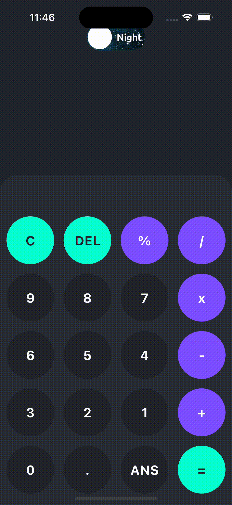

# 🌟 Calculator

A sleek and powerful calculator app built with **Flutter**, designed to make your calculations smooth and stylish! 🌈 Whether you prefer dark or light mode, Calcy has you covered! 🌞🌙  

---

## ✨ Features

- ➕ **Basic Arithmetic Operations**: Add, subtract, multiply, and divide with ease.  
- 🧹 **Clear & Delete**: Reset or fix mistakes with a tap.  
- 📊 **Percentage Calculations**: Effortlessly compute percentages.  
- 🧠 **Answer Memory Recall**: Never lose track of your last result.  
- 🎨 **Dark & Light Mode**: Switch themes to match your vibe.  

---

## 🚀 Getting Started

### 🛠️ Prerequisites  
Ensure **Flutter** is installed on your system. Don’t have it yet? [Get Flutter here](https://flutter.dev/docs/get-started/install).  

### 📥 Installation

1. **Clone the repository**:  
   ```bash
   git clone https://github.com/jerry-lockard/calculator.git
   cd calculator
   ```

2. **Install dependencies**:  
   ```bash
   flutter pub get
   ```

3. **Run the app**:  
   ```bash
   flutter run
   ```

---

## 📂 Folder Structure  

- 🧮 `controller/`: Houses the logic for calculations and theme handling.  
- 🎨 `sections/`: Contains the UI components for input and output sections.  
- 🔧 `utils/`: Utility classes and constants, including color themes.  

---

## 🎯 How to Use

- **🧹 Clear (C)**: Start fresh by resetting the calculator.  
- **❌ Delete (DEL)**: Erase the last entered character.  
- **📊 Percentage (%)**: Quickly find percentages of any number.  
- **⚙️ Operations**: Perform arithmetic with buttons like `+`, `-`, `x`, and `/`.  
- **💾 ANS**: Recall the last calculated answer effortlessly.  
- **✅ Equal (=)**: Solve the current equation and see the magic happen!  

---

## 📜 License  

This project is licensed under the **MIT License**. See the [LICENSE](LICENSE) file for details.  

---

## 🤝 Contributing  

We 💖 contributions! Fork this repo, make improvements, and submit a pull request. Please follow the coding style and include tests for your changes.  

---

## 📬 Contact  

Got questions or ideas? Open an issue on GitHub. We’re here to help! 💬  

---

## 🎥 Demo  

Check out how awesome calculator looks in action! 👇  
  

---
